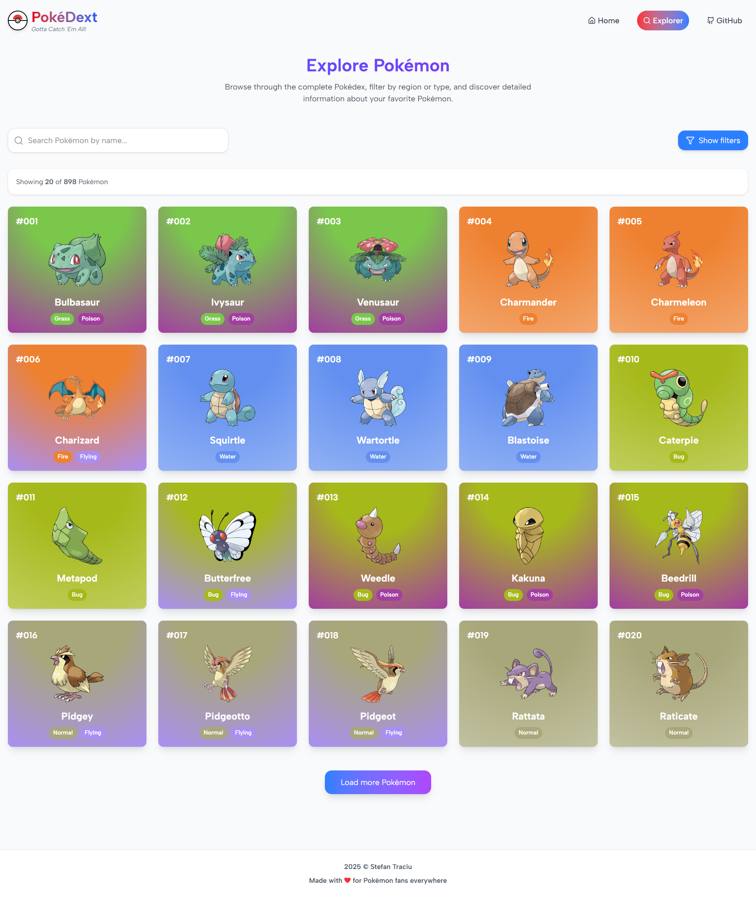

# The Ultimate Pokedex 📖🔍

## Description

Embark on a journey to discover and learn about every Pokémon with this fully functional Pokedex application! Whether you're a seasoned trainer or just starting your adventure, this comprehensive guide provides detailed information and intuitive tools to explore the vast world of Pokémon.

## Screenshot

## Features

- **Effortless Pokémon Search:** Quickly find any Pokémon by name with our intuitive search functionality.

- **Organized Pokémon Listings:** Sort Pokémon by their National Pokedex ID or alphabetical order for easy browsing.

- **Targeted Filtering:** Narrow your search based on Pokémon types.

- **Detailed Pokémon Profiles:** Dive deep into individual Pokémon with a comprehensive modal containing their description, base stats, and intricate evolution chain.

## License

This project is licensed under the MIT License. See the [LICENSE](LICENSE) file for more details.
